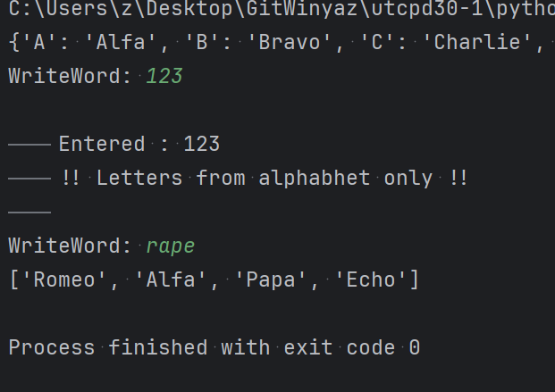

# UTCPD30-1

1. Erros and Exception handling
2. Will involve work from the previos section 
3. In this directory you ran test with kaggle and githubCodeSpace. Those are for testing writing to disk
4. Again test. This line written to fix git in pycharm

## NatoProject from [`utcpd26`](https://github.com/winiyaz/utcpd26/tree/master/NatoProject)

1. [`L230`](./l230) - This coding project for adding exceptions is based on the NATO Project 

## [L231](./L231) - Add Feature Export Json in password manager

1. Code here taken fro - [`utcpd29-1-`](https://github.com/winiyaz/utcpd29-1-/tree/master/pms1)
    1. Now adding exception handling here also

# Dira 

N | ? 
--- | ---
[`KG`](./KG) | Working in kgz
[`l230`](./l230) | Nato Project with exception
[`L231`](./L231) | Upgrading [https://github.com/winiyaz/utcpd29-1-/blob/master/pms1/c.gif](https://github.com/winiyaz/utcpd29-1-/blob/master/pms1/c.gif)

## Completed Upgraded Project 

### L231 - Upgraded Pawsy With features 

---

--- 

### L230 - Upgrading  with exception 

---

---